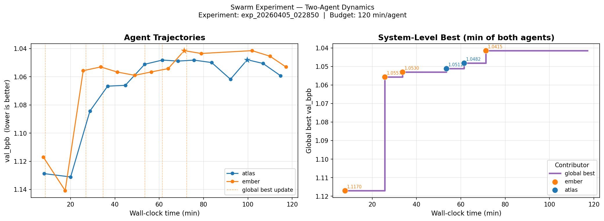
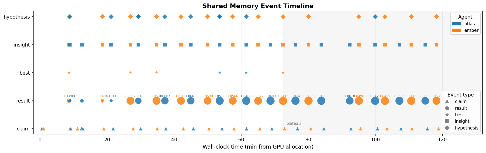
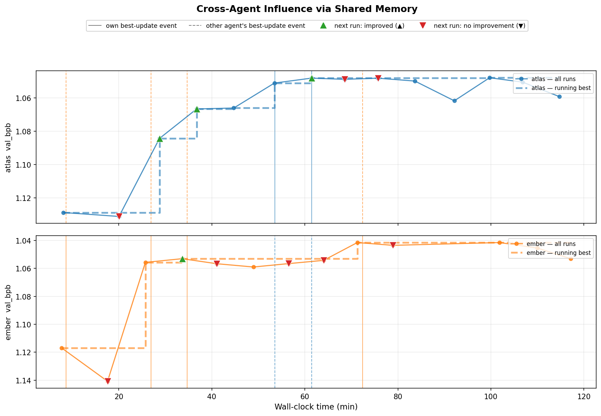
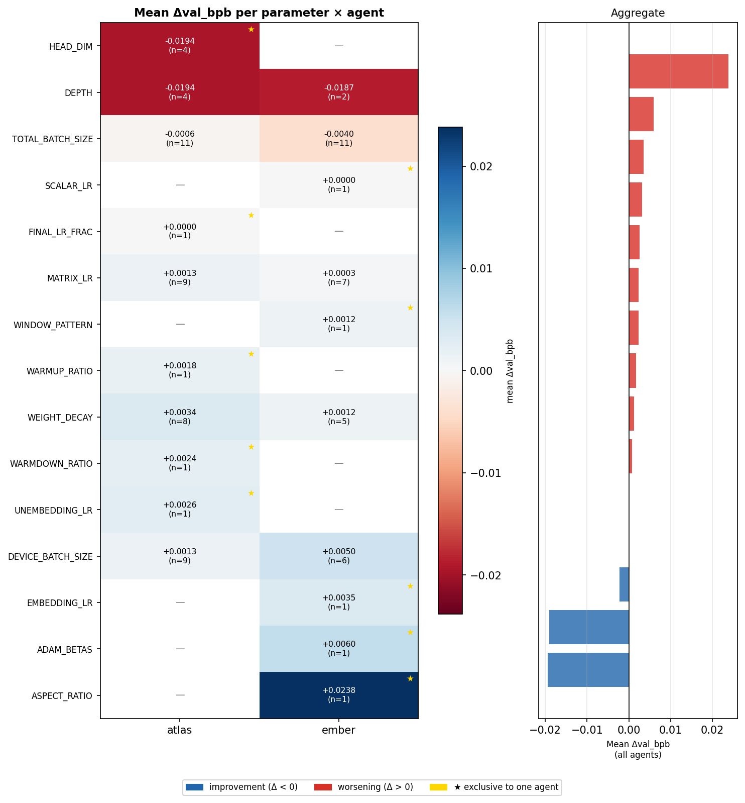
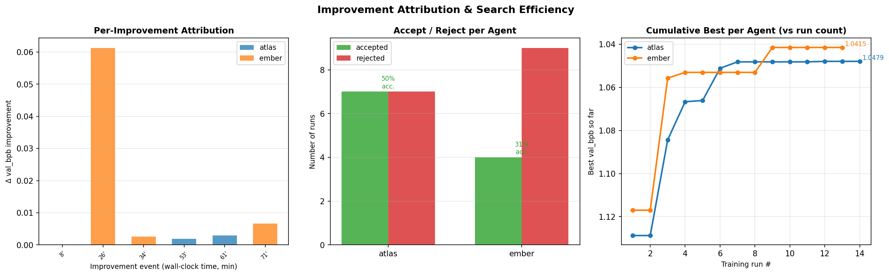

# Swarm Analysis Report

**Experiment:** exp_20260405_022850  
**Budget:** 120 min/agent  
**Agents:** 2  

## Figures

### Joint Trajectory + Global Best

**What it shows:** Left: val_bpb over wall-clock time for each agent, with global-best-update markers (orange dashed). Right: system-level running minimum, colour-coded by contributing agent.

**Interpretation:** Reveals how quickly each agent finds improvements and whether the system-minimum is driven by one agent or both.

### Shared Memory Event Timeline

**What it shows:** Each blackboard event (claim / result / best / insight / hypothesis) shown on a horizontal timeline. Colour = agent, marker shape = event type, size (for results) encodes improvement magnitude.

**Interpretation:** Reveals the rhythm of writes and whether agents interleave (healthy) or cluster (racing). The shaded plateau region shows when no further improvements occurred.

### Cross-Agent Influence via Shared Memory

**What it shows:** Both agents' trajectories in separate panels. Vertical lines mark global-best-update events (solid = own event, dashed = other agent's). Triangles (▲/▼) mark each agent's *next* run after each best-update event.

**Interpretation:** Key question: after one agent improves the global best, does the OTHER agent then improve too? ▲ after dashed line = positive coupling; ▼ = no visible effect.

### Parameter Exploration Heatmap

**What it shows:** Rows = hyperparameters modified, columns = agents. Cell colour = mean Δval_bpb (blue=improvement, red=worsening), annotation = mean delta + count. ★ marks parameters explored by only one agent.

**Interpretation:** Shows specialisation vs redundancy. Exclusive (★) parameters suggest the agents explored complementary regions; shared parameters may reflect memory-mediated convergence.

### Cumulative Improvement Attribution

**What it shows:** Left: each improvement event shown as a bar coloured by responsible agent. Centre: accept/reject counts per agent with acceptance rate. Right: cumulative best val_bpb vs run count for each agent.

**Interpretation:** Answers 'who moved the frontier?'. Equal contribution → efficient parallel exploration; skewed → one agent had a better strategy or luckier initialisation.
